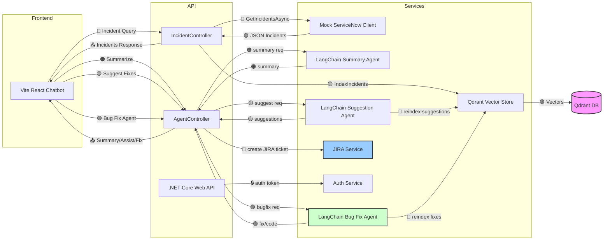

# wf-hackthon-2025

## 🧩 System Architecture

## 🧩Vector Database Interface for RAG

## 🧩 System Architecture (Full Interaction Flow with Vector Sync)

## 🧩 Portal UI Development 
**🟢Demo Work Completion** : 50%  **🟡Actual Integration Pending** : 30%   **🟠Business Logic and Bug Fix** : 20%  

## 🧩 API Inetrface Development
**🟢Demo Work Completion** : 20%  **🔵Demo Work Inprogres** : 30%  **🟡Actual Integration Pending** : 30%   **🟠Business Logic and Bug Fix** : 20% 

